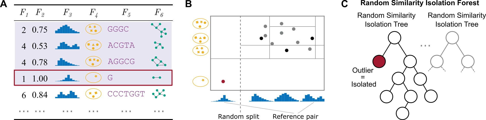

Random Similarity Isolation Forest
==============================



The **Random Similarity Isolation Forest (RSIF)** is a novel outlier detection method for multi-modal data. It can work with numerical data, complex objects e.g graphs or distributions, or mixed-type multi-modal descriptions. It has been tested and evaluated thoroughly on 46 datasets. Evaluation shows show that RSIF is equally good or significantly better than five competitor models: LOF, HBOS, ECOD, Similarity Forest, and Isolation Forest.

# Getting started
To get familiar with RSIF please check **Tutorials** for different data modalities or visit **docs**. Or simply follow this readme for really brief introduction.

**TBD**
# Reproduction steps: 
1. Clone this repository:
```sh
git clone https://github.com/SebChw/Random-Similarity-Isolation-Forest.git
cd Random-Similarity-Isolation-Forest
```
2. Intall RSIF:
```sh
$ pip install -r requirements/requirements.txt
$ pip install -r requirements/requirements_experiments.txt
$ pip install .
```
1. Download precomputed distances matrices from [Zenodo](https://zenodo.org/record/8328048). Unzip downloaded zip archive into the repository foldery. It is necessary since for some types of data e.g graphs some distances calculations for entire dataset took very long (It's only an issue if you use OBJ_RATIO = 1, we show that it can be decreased withouth affecting the performance), we decided to precompute them and provide for you. If you really want to precalculate these distances you can do this by running cells of `notebooks/precalculate_distances.ipynb` - the most heavy calculations went there.
   
2. Now you have 2 choices:
   1. To reproduce both selection of best distances and experiments run `python clean_for_reproduction.py --clean_best`. This will remove `results`, `best_distances` and `figures` folders. Selection of best distances is done with nested repeated holdout. So it takes some time.
   2. To reproduce just experiments run `python clean_for_reproduction.py`. This will remove `results` and `figures` folder.


Next run all cells in:
1. `notebooks/sensitivity_analysis.ipynb`
2. `notebooks/experiments.ipynb`
3. `notebooks/visualizations.ipynb`


# Development

Please get familiar with the documentation inside `docs/build/html/index.html`
For now jupyter with examples is not ready yet. Check `tests/test_integration.py` or `notebooks/utils` to see example usage of RSIF
To use this module

Clone this repo and go inside:
```sh
$ git clone https://github.com/SebChw/Isolation-Similarity-Forest.git
$ cd Isolation-Similarity-Forest
```

Create virtual environment and install needed dependencies:

If you only want to use the library
```sh
$ pip install -r requirements/requirements.txt
```

If you want to develop the library additionally
```sh
$ pip install -r requirements/requirements_dev.txt
```

If you want to run experiments
```sh
$ pip install -r requirements/requirements_experiments.txt
```

If you want to contribute to documentation:
```sh
$ conda install sphinx
$ pip install -r requirements/requirements_docs.txt

```
 To build documentation
 ```sh
$ cd docs
$ make clean
$ make html
 ```

Install `RSIF` in editable mode (Otherwise you would need to have a path to it in your PYTHON_PATH to import it)
```sh
pip install -e .
```

To run all tests with coverage report
```sh
pytest --cov-report html --cov=rsif tests
```

To run just unit tests
```sh
pytest -m "not integration"
```

To run just integration tests. Please if you add new integration test add `@pytest.mark.integration` integration to it
```sh
pytest -m "integration"
```

# Testing
To test, you should also install `tox`.

```sh 
$ pip install tox 
```
Then you can just run it, it'll trigger all tests.
```sh
$ tox
```